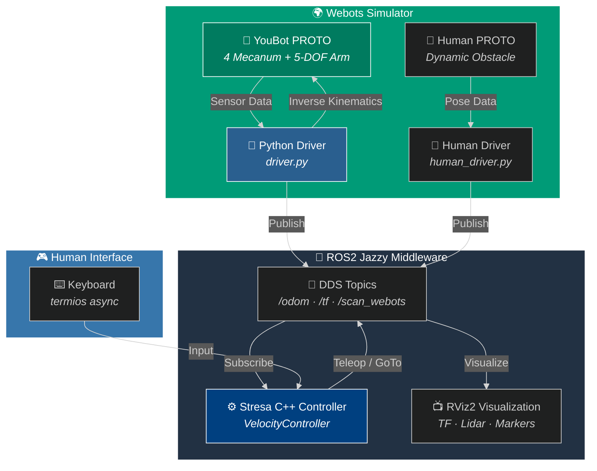
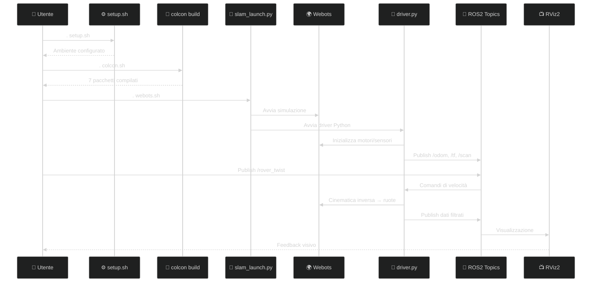

<div align="center">


# 🏥 Kuka YouBot — Omnidirectional Navigation

### *Where Mecanum Wheels Meet Hospital Corridors*

<br>


<br>

**ROS2 Jazzy · Webots · Stresa Framework · Mecanum Kinematics · C++ · Python**

*Un progetto di robotica mobile che implementa il controllo completo del manipolatore mobile **Kuka YouBot** in uno scenario ospedaliero simulato, integrando il simulatore fisico **Webots** con il middleware **ROS2 Jazzy** e il framework di controllo C++ **"Stresa"**.*

<br>

<a href="https://docs.ros.org/en/jazzy/"></a>
<a href="https://www.python.org/"></a>
<a href="https://isocpp.org/"></a>
<a href="https://cyberbotics.com/"></a>
<a href="https://ubuntu.com/"></a>
<a href="https://www.unibg.it/"></a>

<br>

<em>Corso di Ingegneria Informatica — Università degli Studi di Bergamo · A.A. 2025/2026</em>

<br>


</div>

---

> **Κίνησις** (*Kínesi*) — *Ancient Greek*: Movement, motion, change. The essence of robotics — the art of making machines move with purpose through the world.

---

## 🌟 Abstract

<div align="center">

</div>

<br>

> [!TIP]
> **Obiettivo del progetto**: dimostrare capacità di **navigazione olonoma**, **teleoperazione** e **targeting autonomo** di un manipolatore mobile in un ambiente ospedaliero realistico, integrando simulazione fisica, middleware ROS2 e framework di controllo C++.

Il sistema combina:

- 🧠 **Intelligenza distribuita** tramite nodi ROS2 comunicanti
- 🎯 **Precisione cinematica** con ruote Mecanum in configurazione ABBA
- 👁️ **Percezione avanzata** con Lidar, camera e IMU
- 🏥 **Realismo fisico** con parametri di attrito calibrati
- 🤖 **Manipolazione mobile** con braccio a 5 DOF

---

## ✨ Features

<div align="center">

| 🦾 **Cinematica & Controllo** | 🧠 **Percezione & Navigazione** | 🏥 **Simulazione & Sistema** |
| :---: | :---: | :---: |
| 🛞 **Mecanum ABBA** omnidirezionale<br/>🎮 **Teleoperazione** asincrona (C++)<br/>🔄 **Odometria & TF** dinamiche | 🎯 **GoTo Autonomo** con R(−θ)<br/>📡 **Lidar RPlidar A3M1** filtrato<br/>👁️ **Camera + Recognition API** | 🏥 **Scenario Ospedaliero** Webots<br/>⚙️ **Fisica realistica** (frictionRotation)<br/>👥 **Ostacoli dinamici** (Human Driver) |

</div>

---

## 🏗 Architettura di Sistema



---

## 🛠 Stack Tecnologico

| Categoria | Tecnologia | Dettagli |
| :---: | :--- | :--- |
| 🌐 **Middleware** | **ROS2 Jazzy** | Comunicazione DDS, Topic, TF2, Launch files |
| 🌍 **Simulatore** | **Webots** | `webots_ros2_driver`, Fisica custom, PROTO |
| 🐍 **Linguaggi** | **Python 3.12** / 🏎️ **C++** | Driver, Cinematica, Framework Stresa |
| 📐 **Matematica** | **pytransform3d** / **numpy** | Trasformate rigide, Quaternioni, Matrici |
| 📦 **Messaggi** | **Custom Msgs** | `aruco_msgs`, `aurora_msgs`, `rover_msgs` |
| 📺 **Visualizzazione** | **RViz2** | Debug TF, Lidar, Marker 3D, Traiettorie |
| 🔨 **Build System** | **colcon** | Compilazione workspace multi-pacchetto |

---

## 📡 Telemetria e Comunicazioni

> [!NOTE]
> Il sistema si basa su un robusto scambio di messaggi ROS2 tramite il protocollo DDS. Ecco i canali principali:

| 📡 Topic | 🔄 Dir. | 📦 Tipo | 📝 Contenuto |
| :--- | :---: | :--- | :--- |
| `rover_twist` | 📥 **Sub** | `geometry_msgs/Twist` | Comandi di velocità ($v_x, v_y, \omega_z$) |
| `/odom` | 📤 **Pub** | `nav_msgs/Odometry` | Odometria stimata dal driver |
| `/scan_webots` | 📤 **Pub** | `sensor_msgs/LaserScan` | Lidar filtrato (auto-occlusioni rimosse) |
| `/visual_objects` | 📤 **Pub** | `Object3DArray` | Marker 3D riconosciuti dalla camera |
| `/camera/image_raw` | 📤 **Pub** | `sensor_msgs/Image` | Stream video dalla camera |
| `/tf` | 📤 **Pub** | `tf2_msgs/TFMessage` | Trasformate `odom` → `base_link` |
| `/rover_info` | 📤 **Pub** | Custom | Informazioni di stato del robot |

---

## ⚙️ Il Cuore del Codice

<div align="center">

</div>

<br>

### 🧮 Matrice Cinematica (Mecanum ABBA)

La cinematica inversa per la configurazione **ABBA** (con $L = l_x + l_y \approx 0.393\,\text{m}$) è implementata nel `driver.py`:

$$
\begin{bmatrix}
\omega_{FL} \\ \omega_{FR} \\ \omega_{BL} \\ \omega_{BR}
\end{bmatrix} =
\frac{1}{r}
\begin{bmatrix}
1 & -1 & -L \\
1 & 1 & L \\
1 & 1 & -L \\
1 & -1 & L
\end{bmatrix}
\begin{bmatrix}
v_x \\ v_y \\ \omega_z
\end{bmatrix}
$$

> [!IMPORTANT]
> **Parametri geometrici critici:**
> - Raggio ruote: $r = 0.05\,\text{m}$
> - Semi-passo asse $x$: $l_x = 0.235\,\text{m}$
> - Semi-carreggiata asse $y$: $l_y = 0.158\,\text{m}$
> - $L = l_x + l_y \approx 0.393\,\text{m}$

### 🧲 Il Segreto della Fisica Webots

> [!CAUTION]
> **Il parametro `frictionRotation` è il fattore abilitante del moto laterale!**
> La sola cinematica inversa corretta **non basta** se la fisica dell'attrito non genera le forze tangenziali necessarie ai rullini.

```cpp
ContactProperties {
    material1 "InteriorWheel"
    material2 "ground"
    coulombFriction [ 0, 2 ]
    frictionRotation -0.785398 0  // 🔑 Essenziale: -45° per i rullini!
}
```

### 🧭 Trasformazione Globale → Locale (GoTo)

Nel controller C++ Stresa, la correzione dell'angolo di rotazione è critica per evitare deviazioni sistematiche:

```cpp
// ✅ Corretto: Rotazione inversa R(−θ)
twist_vx = 0.2 * cos(alpha - odo_z);
twist_vy = 0.2 * sin(alpha - odo_z);

// ❌ SBAGLIATO: Causa deviazioni a 45°
// twist_vx = 0.2 * cos(alpha + odo_z);
```

### 🎯 Logica GoTo Autonomo

```cpp
// Target fisso a (1.0, 1.0) nel frame globale
// Velocità angolare costante ω_z = 0.157 rad/s
// Soglia di raggiungimento: 0.25 m (distanza euclidea)

if (distance_to_target < 0.25) {
    // Ritorno alla modalità manuale
    mode = MANUAL;
}
```

---

## 🗂 Struttura del Workspace

<details>
<summary><strong>📂 Clicca per espandere l'albero dei file</strong></summary>

```text
SERLab/Webots/
├── 📦 build/                          # Artefatti di compilazione colcon
├── 📦 install/                        # Workspace installato
├── 📋 log/                            # Log di build
├── ⚙️ setup.sh                        # Setup ambiente (ROS_DOMAIN_ID, PYTHONPATH)
├── ⚙️ colcon.sh                       # Alias per colcon build
├── ⚙️ webots.sh                       # Script di lancio simulazione
│
└── 📁 src/
    ├── 📦 aruco_msgs/                 # Messaggi custom per marker ArUco
    ├── 📦 aurora_msgs/                # Messaggi custom
    ├── 📦 rover_msgs/                 # Messaggi custom del rover
    ├── 📦 cpp_pubsub/                 # Nodi C++ (framework Stresa)
    ├── 📦 util/                       # Utility condivise
    │
    └── 📦 webots_hospital_youbot/     # 🏥 Pacchetto principale
        ├── 📁 launch/
        │   ├── 📜 slam_launch.py           # Launch SLAM
        │   └── 📜 localization_launch.py   # Launch localizzazione
        ├── 📁 resource/
        │   ├── 📄 YoubotBase_slam.urdf
        │   ├── 📄 YoubotBase_localization.urdf
        │   └── 📄 human.urdf
        ├── 📁 worlds/
        │   ├── 📁 protos/
        │   │   └── 🤖 Youbot.proto         # Modello robot
        │   └── 🏥 webots_hospital_youbot.wbt
        ├── 📁 webots_hospital_youbot/
        │   ├── 🐍 __init__.py
        │   ├── 🐍 driver.py                # Driver principale
        │   └── 🐍 human_driver.py          # Driver ostacoli dinamici
        └── 📄 setup.py                     # Entry points
```

</details>

> [!WARNING]
> **Mapping ruote incrociato:** Nel PROTO, `wheel2` corrisponde alla ruota *anteriore sinistra* del modello cinematico. Non modificare la mappatura nel `driver.py` senza verificare la matrice Jacobiana!

---

## 🔄 Workflow Operativo



---

## 🧪 Validazione Sperimentale

> [!IMPORTANT]
> Il sistema è stato rigorosamente testato per garantire la coerenza tra modello teorico e simulazione fisica.

### ✅ Test di Movimento
Verifica di $v_x$, $v_y$ (strafe) e $\omega_z$ dopo la calibrazione di `frictionRotation`.

### ✅ Validazione Cinematica GoTo

| Parametro | Valore |
| :--- | :--- |
| $v_x$ | $0.06\,\text{m/s}$ |
| $v_y$ | $0.06\,\text{m/s}$ |
| $\omega_z$ | $\approx 0.2\,\text{rad/s}$ |
| **Modulo velocità risultante** $|v|$ | $\approx 0.085\,\text{m/s}$ |
| **Raggio di curvatura** $R$ | $\approx 0.425\,\text{m}$ |

> [!SUCCESS]
> **Esito:** Coerente al 100% con la traiettoria osservata in RViz. Il modello cinematica risponde correttamente ai comandi.

---

## 🗺 Roadmap

<div align="center">

</div>

<br>

### 🚧 In Progress / Planned

- [ ] 🚧 **Obstacle Avoidance Reattivo**
  - Implementazione di **Campi di Potenziale Artificiale (APF)**
  - Alternativa: **Vector Field Histogram (VFH)**
  - Input: dati dal topic `/scan_webots`

- [ ] 🗺️ **SLAM Avanzato**
  - Integrazione di `slam_toolbox` o **Cartographer**
  - Mappatura e localizzazione *ground-truth free*

- [ ] 🦾 **Manipolazione Mobile**
  - Cinematica inversa del braccio a **5 DOF**
  - Task di *Pick & Place* dinamico

- [ ] 🎯 **Target Dinamici**
  - Sostituzione dei target hard-coded con **topic/parametri ROS2** configurabili in runtime

### ✅ Completed

- [x] 🛞 **Cinematica Mecanum ABBA** implementata e validata
- [x] 🎮 **Teleoperazione da tastiera** con controller C++ Stresa
- [x] 🎯 **Navigazione GoTo** con trasformazione globale→locale corretta
- [x] 📡 **Driver sensori** con filtraggio auto-occlusioni Lidar
- [x] 🧭 **Odometria e TF** dinamiche
- [x] ⚙️ **Fisica Mecanum** con `frictionRotation` calibrato
- [x] 👥 **Ostacoli dinamici** (umani) con driver dedicato


## 🤝 Contributing

<div align="center">

### 🚀 Come contribuire in 5 passi

</div>

> [!TIP]
> Vuoi migliorare il progetto? I contributi sono benvenuti!

1. 🍴 **Fork** del repository
2. 🌿 Crea un branch feature:
   ```bash
   git checkout -b feature/obstacle-avoidance
   ```
3. 💾 Commit delle modifiche:
   ```bash
   git commit -m '✨ Aggiunto APF per obstacle avoidance'
   ```
4. 🚀 Push del branch:
   ```bash
   git push origin feature/obstacle-avoidance
   ```
5. 📬 Apri una **Pull Request**

---

## 🙏 Acknowledgements

<div align="center">

Questo progetto non sarebbe stato possibile senza:

</div>

- 🏛️ **[Università degli Studi di Bergamo](https://www.unibg.it/)** — Corso di Ingegneria Informatica
- 🌐 **[ROS2 Jazzy](https://docs.ros.org/en/jazzy/)** — Middleware di robotica di classe mondiale
- 🌍 **[Webots](https://cyberbotics.com/)** — Simulatore robotico professionale open source
- ⚙️ **[Stresa Framework](https://github.com/)** — Framework C++ per il controllo robotico
- 🐍 **[pytransform3d](https://pytransform3d.readthedocs.io/)** — Trasformate rigide in Python
- 📐 **[pyquaternion](http://kieranwynn.github.io/pyquaternion/)** — Quaternioni per Python
- 🎨 **[Charm](https://charm.sh/)** — Ispirazione per il design del README
- 📺 **[RViz2](https://github.com/ros2/rviz)** — Visualizzazione 3D per ROS2

---

## 📄 License

> [!NOTE]
> **Materiale accademico** — Università degli Studi di Bergamo.<br>
> Tutti i diritti riservati agli autori.

---

<div align="center">

## 👥 Il Team

<br>

<table>
<tr>
<td align="center" width="33%">
<br/>
<sub><b>Sviluppatore & Designer</b></sub><br/>
<sub>Matricola: <code>1079287</code></sub>
</td>
<td align="center" width="33%">
<br/>
<sub><b>Sviluppatore & Designer</b></sub><br/>
<sub>Matricola: <code>1073364</code></sub>
</td>
<td align="center" width="33%">
<br/>
<sub><b>Sviluppatore & Designer</b></sub><br/>
<sub>Matricola: <code>1074130</code></sub>
</td>
</tr>
</table>

<br>

---

<br>

### ⚡ Powered by ROS2 Jazzy, Webots & Stresa Framework ⚡

### 🏥 Making Hospital Robotics Smarter 🏥

<br>


<br>

<sub>© 2026 — Università degli Studi di Bergamo · Ingegneria Informatica</sub>

<br>


</div>
```
